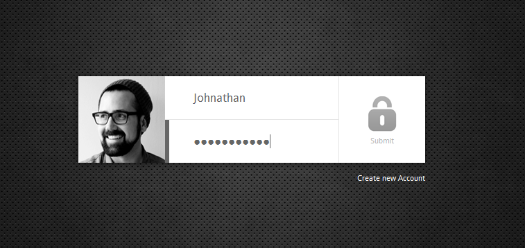
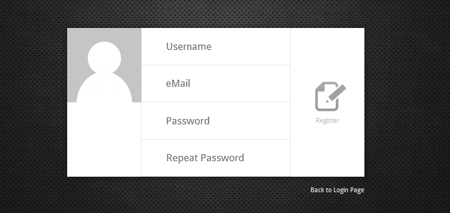

# Sexy simple PHP Login #

**THIS IS A GITHUB PREVIEW ! WHAT YOU SEE IS NOT READY TO RELEASE ! IT'S A PREVIEW!**

TODO: Legal rights for demo avatar pictures, full docs, no inline css, alternative theme, prepared statements

Always find the latest version, a documentation and other stuff on the project website:
http://www.php-login.net

*A sexy, clean, stylish, non-nerdy, well documented, object-oriented, totally free and reduced to the max PHP login script*

## HOW TO INSTALL ##

* 1. create database "login" and table "users" via the sql statements or the .sql file in folder "_install"
* 2. change mySQL user and or mySQL password in config/db.php ("DB_USER" and "DB_PASS").

###CONFIGURE

* you can set the lifetime of a session (until you will be logged out automatically) by changing the value of session.gc_maxlifetime in the php.ini (in seconds, for example 3600 is a hour, 36000 are ten hours)

###REQUIREMENTS / TROUBLESHOOTING

* needs PHP 5.3+ or PHP 5.4+
* needs mySQL 5.1+
* needs the PHP mysqli (last letter is an "i") extension activated (standard on nearly all modern servers) ?
* are the database connection infos in config/db.php correct ?
* have you created a database named "login" like mentioned above ?
* does the provided database user (standard is "root") have rights to read (and write) the database ?

### USAGE WITH OLDER PHP VERSIONS (older than 5.3)

Sorry, this makes no sense anymore. PHP 5.2 is outdated since 2009, so supporting this would be useless.