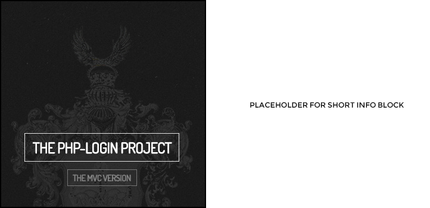
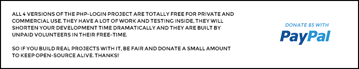

# php-login 3.0

2.0 can be found in the master branch (and as a 2.0 release tag), 3.0 is in the develop branch. 2.0 will not be touched
anymore unless there's a serious bug. If so, please create a feature-branch of master branch that contains the fix.

*Thanks for 1.000+ stars and 400+ forks. Wow!*

### A PHP & MySQL login script built into a skeleton MVC application

This script is part of the **PHP Login Project**, a collection of four similar login scripts for different use-cases.
This script here is the MVC framework version.
Find the official portal page of the project here: **[php-login.net](http://www.php-login.net)**.
Follow the project on **[Twitter](https://twitter.com/simplephplogin)**,
**[Facebook](https://www.facebook.com/pages/PHP-Login-Script/461306677235868)** or
**[Google+](https://plus.google.com/104110071861201951660)** and have a look on the official support blog
**[Dev Metal](http://www.dev-metal.com)**.
Ask questions in the **[Official Support Forum](http://support-forum.php-login.net/)**.

### MVC Framework Version 3.0 (this one here)

TODO

### MVC Framework Version 2.0 (older version of this one here)
* built with the official PHP password hashing functions, fitting the most modern password hashing/salting web standards
* users can register, login, logout (with username, email, password)
* users can register and login via Facebook (official Facebook PHP SDK used)
* [planned: users can register/login via Twitter, Google+, etc.]
* password-forget/reset
* remember-me (login via cookie)
* account verification via mail
* captcha
* failed-login-throttling
* user profiles
* account upgrade/downgrade
* supports local avatars and remote Gravatars
* supports native mail and SMTP sending (via PHPMailer)
* comes with a super-sexy Model-View-Controller (MVC) barebone-application structure
* uses PDO for database access
* uses URL rewriting ("beautiful URLs")
* file- and folder protection via .htaccess
* uses Composer to load external dependencies (PHPMailer, Facebook SDK, Captcha-Generator, etc.)
* can be installed via Composer
* fits PSR-1/2 coding guidelines
* fully commented
* is actively developed, maintained and bug-fixed
* has detailed tutorials
* [planned: ready-to-go PuPHPet files and Vagrant boxes]

### Other (smaller) versions of this script

#### One File Version [https://github.com/panique/php-login-one-file]
Full login script in one file. Uses a one-file SQLite database (no MySQL needed) and PDO. Features: Register,
login, logout.

#### Minimal Version [https://github.com/panique/php-login-minimal]
All the basic functions in a clean file structure, uses MySQL and mysqli. Register, login, logout.

#### Advanced Version [https://github.com/panique/php-login-advanced]
Same like minimal (uses MySQL and PDO), but much more features:
Register, login, logout, email verification, password reset, edit user data, gravatars, captchas,
remember me / stay logged in cookies, "remember me" supports parallel login from multiple devices,
login with email, i18n/internationalization, mail sending via PHPMailer (SMTP or PHP's mail() function/linux sendmail).

## What's new in version 3.0 ?

TODO

## What's new in version 2.0 ?

- professional file/folder structure
- Composer
- Facebook login/registration
- mostly implemented the "always return something" rule, with default return
- if/else nesting as flat as possible
- implemented dependency injected database connection (we open just one connection, use it for all models)
- multiple models allowed per controller
- everything is "as manual as possible"
- massive refactoring

## Live Demo

See a [live demonstration](http://php-login.net/demo4.html) or [see the server's phpinfo()](http://phpinfo.php-login.net/).

## Requirements

Make sure you know the basics of object-oriented programming and MVC, are able to use the command line and have
used Composer before. This script is not for beginners.

* **PHP 5.3.7+**, PHP 5.4+ or PHP 5.5+
* **MySQL 5** database (better use versions 5.5+ as very old versions have a [PDO injection bug](http://stackoverflow.com/q/134099/1114320)
* installed PHP extensions: pdo, gd, openssl (the tutorial shows how to do)
* installed tools on your server: git, curl, composer (the tutorial shows how to do)
* for professional mail sending: an SMTP account (I use [SMTP2GO](http://www.smtp2go.com/?s=devmetal))
* activated mod_rewrite on your server (the tutorial shows how to do)

## License

Licensed under [MIT](http://www.opensource.org/licenses/mit-license.php). Totally free for private or commercial projects.

## Contribute

Please commit only in *develop* branch. The *master* branch will always contain the stable version.

## Support / Donate

If you think this script is useful and saves you a lot of work, then think about supporting the project:

1. Rent your next server at [DigitalOcean](https://www.digitalocean.com/?refcode=40d978532a20).
2. Donate via [PayPal](https://www.paypal.com/cgi-bin/webscr?cmd=_s-xclick&hosted_button_id=P5YLUK4MW3LDG)
   or [GitTip](https://www.gittip.com/Panique/)
3. Contribute to this project.

## Themes / User Interfaces / Styles

Bookmark the highly related partner-project "[php-login-styles](https://github.com/panique/php-login-styles)" which
will host beautiful themes for php-login and the eventually also for the smaller version (see above).
This project has not been started yet.

## Current and further development

See active issues and requested features here:
https://github.com/panique/php-login/issues?state=open

See the milestone tracking of 2.0 and the upcoming 3.0 (early 2015) here:
https://github.com/panique/php-login/issues/milestones

## External installation guidelines

* [How to install php-login on Ubuntu 12.04 LTS](http://www.dev-metal.com/install-php-login-nets-4-full-mvc-framework-login-script-ubuntu/)
* [How to install php-login on Ubuntu 14.04 LTS](http://www.dev-metal.com/install-php-login-nets-php-login-script-mvc-version-ubuntu-14-04-lts/)
* [How to install php-login on Windows 7 / 8 (for development)](http://www.dev-metal.com/install-php-login-windows-7-8/)

## Installation on Ubuntu 12.04 LTS

This installation guideline uses Ubuntu 12.04 LTS (as it is the standard and by far the most long-term supported
mainstream server OS (supported until 2017). For more, see the
[Wikipedia page of Ubuntu versions](http://en.wikipedia.org/wiki/List_of_Ubuntu_releases#Table_of_versions).

When developing in a Vagrant box: please note that it's quite difficult to identify a Vagrant box to Facebook's App API,
so currently there's no guideline on how to use the Facebook login-feature when using a LOCAL Vagrant box.
For more, see [this StackOverflow question](http://stackoverflow.com/questions/20615924/how-to-run-a-facebook-app-on-an-ip-domain-works-localhost-works-ip-does-not).

#### ON YOUR SERVER (we use Ubuntu 12.04 LTS here):
1. install Apache, MySQL, PHP and eventually PHPMyAdmin: [How to setup a LAMP stack on Ubuntu 12.04](http://www.dev-metal.com/setup-basic-lamp-stack-linux-apache-mysql-php-ubuntu-12-04/)
2. install mod_rewrite and activate it: [How to enable mod_rewrite in Ubuntu 12.04 LTS](http://www.dev-metal.com/enable-mod_rewrite-ubuntu-12-04-lts/)
3. install Composer: [How to install Composer on Ubuntu](http://www.dev-metal.com/install-update-composer-windows-7-ubuntu-debian-centos/)
4. install GD (for the Captcha): `sudo apt-get install php5-gd`, restart Apache `sudo service apache2 restart`
5. install OpenSSL (to send mails): `sudo apt-get install openssl`, restart Apache `sudo service apache2 restart`
6. remove all files from the */var/www* (should only be Apache's index.html and your phpinfo()-containing .php right now) with `rm -r /var/www/*`,
otherwise things will get messy and git won't download the repo into a non-empty folder
7. copy the contents of the extracted php-login repository into /var/www ! In this tutorial we don't use a sub-folder,  so your index.php should go into /var/www !
Best way to do is cloning via git: `git clone https://github.com/panique/php-login.git /var/www` or by creating the
project via Composer: `composer create-project panique/php-login /var/www dev-master`
8. Make the repo's folder *public/avatars* writable via `chmod 775 /var/www/public/avatars` and check its rights with `stat /var/www/public/avatars`
9. Run the three SQL statements in the *application/_installation/sql_statements* folder (the installation folder has an underscore in front of its name, but GitHub doesn't show this due to
a bug in its README-parser), via PHPMyAdmin (look at the files directly on https://github.com/panique/php-login/) or do it via mysql command-line

#### CONFIGS IN THE CODE:

In *application/config/config.php*:

11. enter your database credentials in DB_USER, DB_PASS etc.
12. enter your project URL into URL, don't forget the trailing slash!
13. edit COOKIE_DOMAIN to the above URL
14. in the SMTP block, set EMAIL_USE_SMTP tp `true` and put in your SMTP provider credentials ((I use [SMTP2GO](http://www.smtp2go.com/?s=devmetal))). Please remember:
You cannot simply send emails with PHP's mail() function, this does not really work due to a lot of reasons.
For development it could make sense to set PHPMAILER_DEBUG_MODE to 2 as this will echo out errors and notices when sending mails.
15. OPTIONAL for development (better leave it like it is !), but necessary for production environments: Change the text,
reply-mail-address etc. of the EMAIL_PASSWORD_RESET_SUBJECT etc.

In *.htaccess*:

1. Change the RewriteBase: when using the script within a sub-folder, put this path here, like */mysubfolder/* !
If your app is in the root of your web folder, then delete this line or comment it out.

#### RUN COMPOSER:
1. go into the base folder of your application (where composer.json is) (`cd /var/www`) and do `composer install` on the command line

**Voila!** You app should now run fine.

#### To use the (optional) Facebook login

Note: Facebook changes the look, the UI and the way the Facebook App pages work permanently. But you'll find out what's
meant. Go to https://developers.facebook.com/apps/ and create a new app.
Go to "preferences" or whatever it is called, enter your email adress, leave "App Domain" empty, click on "Add platform"
and put your URL in "Site URL" (completely with "http://www."), save. For local development "localhost" works.
Things like "127.0.0.1" don't seem work. In earlier version of Facebook's App API you needed to set "sandbox mode" to
"deactivated", now... well... I don't know, they have removed the button but the app still says "in development mode".

Set `FACEBOOK_LOGIN` in *application/config/config.php* to `true` and put your Facebook app id and the secret token
in `FACEBOOK_LOGIN_APP_ID` and `FACEBOOK_LOGIN_APP_SECRET`.

You should see the Facebook login / register buttons on the login / register page of your php-login app now.

## Useful links

- [How to use PDO](http://wiki.hashphp.org/PDO_Tutorial_for_MySQL_Developers)
- [A short guideline on how to use the PHP 5.5 password hashing functions and its PHP 5.3 & 5.4 implementations](http://www.dev-metal.com/use-php-5-5-password-hashing-functions/)
- [How to setup latest version of PHP 5.5 on Ubuntu 12.04 LTS](http://www.dev-metal.com/how-to-setup-latest-version-of-php-5-5-on-ubuntu-12-04-lts/)
- [How to setup latest version of PHP 5.5 on Debian Wheezy 7.0/7.1 (and how to fix the GPG key error)](http://www.dev-metal.com/setup-latest-version-php-5-5-debian-wheezy-7-07-1-fix-gpg-key-error/)
- [Notes on password & hashing salting in upcoming PHP versions (PHP 5.5.x & 5.6 etc.)](https://github.com/panique/php-login/wiki/Notes-on-password-&-hashing-salting-in-upcoming-PHP-versions-%28PHP-5.5.x-&-5.6-etc.%29)
- [Some basic "benchmarks" of all PHP hash/salt algorithms](https://github.com/panique/php-login/wiki/Which-hashing-&-salting-algorithm-should-be-used-%3F)
- [How to prevent PHP sessions being shared between different apache vhosts / different applications](http://www.dev-metal.com/prevent-php-sessions-shared-different-apache-vhosts-different-applications/)

You can find more in the project's [github wiki](https://github.com/panique/php-login/wiki).

#### If you like the folder/file structure

Then have a look into the partner project PHP-MVC on http://www.php-mvc.net and https://github.com/panique/php-mvc.
A super-reduced and naked bare-bone application.

## How the facebook login process works

https://github.com/facebook/facebook-php-sdk

https://developers.facebook.com/docs/php/gettingstarted/

## Used packages (via composer)

PHPMailer
https://packagist.org/packages/phpmailer/phpmailer

PHP password compatibility library
https://packagist.org/packages/ircmaxell/password-compat

Facebook SDK
https://packagist.org/packages/facebook/php-sdk

Gregwar's Captcha
https://packagist.org/packages/gregwar/captcha

Kint (a better var_dump)
https://packagist.org/packages/raveren/kint

## Thanks

This project is kindly powered by **[PHPStorm](http://www.jetbrains.com/phpstorm/)**.
A big "Thank You!" to IntelliJ for giving php-login free licenses of this wonderful IDE.

## Hire me

I'm available for freelance work, mainly PHP and frontend. Remote worldwide or locally around Central Europe.
Please send a mail if you like, you can find out my email address easily.
